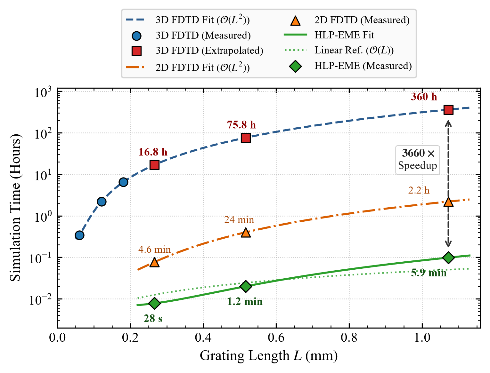

# HLP-EME: Hierarchical Locally Periodic Eigenmode Expansion

[](https://opensource.org/licenses/MIT)
[](https://www.python.org/downloads/)
[](https://arxiv.org/abs/2609.30224)

A structure-aware, full-vectorial simulation framework designed for millimeter-long, complex-modulated silicon photonic integrated Bragg gratings (IBGs).

---

## Overview

Full-vectorial electromagnetic simulation of the physical layout is essential for accurately evaluating device performance in silicon photonics. However, for integrated Bragg gratings (IBGs), this verification step remains computationally challenging. Practical IBGs typically span hundreds of micrometers to several millimeters to achieve advanced spectral functionalities—such as arbitrary amplitude and phase response tailoring, sub-nanometer bandwidth FSR-free filtering, and dispersion engineering via chirped profiles. At these length scales, standard 3D finite-difference time-domain (FDTD) and conventional eigenmode expansion (EME) methods become computationally prohibitive.

**Hierarchical Locally Periodic Eigenmode Expansion (HLP-EME)** overcomes this bottleneck by exploiting local periodicity and hierarchical scattering-matrix decomposition. It delivers full-vectorial accuracy while reducing simulation runtimes for **millimeter-long gratings to just minutes** on multi-core workstations (and **tens of minutes** on standard desktop computers).

---

## Key Features

- **Full-Vectorial and Structure-Aware**: Accurately captures 3D physical layout geometries, sidewall corrugation profiles, and higher-order or radiation mode couplings by combining rigorous cross-sectional eigenmode solving with hierarchical locally periodic decomposition.
- **High Computational Efficiency**: Achieves over three orders of magnitude speedup compared to 3D-FDTD. Figure 1 benchmarks the runtime scaling on 1-μm-wide asymmetric multimode IBGs with $\text{TE}_0\text{–}\text{TE}_1$ mode conversion on a silicon-on-insulator (SOI) platform. 

<p align="center">
  
  <br>
  <em><b>Fig. 1:</b> Computational runtime comparison versus grating length <i>L</i> for 3D-FDTD, 2D-FDTD, and HLP-EME. Lines indicate polynomial scaling (&Omicron;(<i>L</i><sup>2</sup>) for FDTD vs. &Omicron;(<i>L</i>) for HLP-EME). Square markers for 3D-FDTD represent extrapolated values from short-device benchmarks. Benchmarking platform: Dual AMD EPYC 7542 CPUs, 256 GB RAM (16*16 GB). Both FDTD and EME were benchmarked using 56 MPI processes with 1 thread per process.</em>
</p>


- **Versatility Across IBG Architectures**:
  - Intra-mode Bragg gratings
  - Multimode gratings with mode-conversion 
  - Grating-assisted contra-directional couplers (CDCs)
  - **Curved and spiral Bragg gratings**
- **Flexible Apodization Schemes**:
  - Native support for lateral phase-delay modulation (LPDM)
  - Readily extensible to corrugation width modulation, duty-cycle modulation, and cladding index perturbations
- **Solver-Agnostic Architecture**: While the current implementation interfaces with the Ansys Lumerical MODE backend via its Python API, the underlying theoretical framework is solver-independent and can be adapted to open-source 2D finite-difference eigenmode (FDE) solvers.

---

## Quick Start

### Prerequisites

- **Python**: `>= 3.13.5`
- **Ansys Lumerical MODE** (with the Python API `lumapi` configured)

### Environment Variable Setup

To enable the framework to locate the Lumerical Python API (`lumapi`), set the `lumapi_path` environment variable to your local Lumerical installation directory before running any scripts (see `src/hlp_eme/lum.py` for implementation details).

By default, `lumapi` is located at:
- **Windows**: `C:\Program Files\Lumerical\v2xx\api\python` *(replace `v2xx` with your installed version, e.g., `v241`)*
- **Linux**: `/opt/lumerical/v2xx/api/python`

#### Setting the Path

- **Windows (PowerShell):**
  ```powershell
  $env:lumapi_path = "C:\Program Files\Lumerical\v2xx\api\python"
  ```

- **Linux / macOS (Bash/Zsh):**
  ```bash
  export lumapi_path="/opt/lumerical/v2xx/api/python"
  ```

---

### Installation

This project is packaged via `pyproject.toml`. Using an isolated virtual environment (`venv`) is recommended:

1. **Clone the repository:**
   ```bash
   git clone [https://github.com/your-username/HLP-EME.git](https://github.com/your-username/HLP-EME.git)
   cd HLP-EME
   ```

2. **Create and activate a virtual environment:**
   - **Linux / macOS:**
     ```bash
     python3 -m venv .venv
     source .venv/bin/activate
     ```
   - **Windows (PowerShell):**
     ```powershell
     python -m venv .venv
     .venv\Scripts\Activate.ps1
     ```

3. **Install dependencies (editable mode):**
   
   ```bash
   pip install --upgrade pip
   pip install -e .
   ```

### Running an Example

Interactive tutorials are provided as Jupyter Notebooks in the [`Examples/`](https://github.com/ruicheng-photonics/hlp-eme/tree/main/examples) directory.

Launch Jupyter and open any notebook (e.g., `straight_ibg.ipynb`) to step through the geometry construction, HLP-EME solver configuration, and spectral response evaluation.

---

## Citation

If you use this simulation framework or methodology in your research, please cite our paper  ([arXiv:2609.30224](https://arxiv.org/abs/2609.30224)):

```bibtex
@article{cheng2026efficient,
  title         = {Efficient simulation of millimeter-scale complex-modulated integrated {Bragg} gratings via hierarchical locally periodic eigenmode expansion},
  author        = {Cheng, Rui and Meng, Jia and Yu, Ping and Wang, Jihao and Xie, Zikun},
  journal       = {arXiv preprint arXiv:2609.30224},
  year          = {2026},
  eprint        = {2609.30224},
  archivePrefix = {arXiv},
  primaryClass  = {physics.optics},
  url           = {https://arxiv.org/abs/2609.30224}
}
```

In addition, the grating synthesis workflow and physical layout mapping framework build upon:

- [1] R. Cheng and L. Chrostowski, "Spectral Design of Silicon Integrated Bragg Gratings: A Tutorial," *Journal of Lightwave Technology*, vol. 39, no. 3, pp. 712–729, Feb. 2021, doi: [10.1109/JLT.2020.3035372](https://doi.org/10.1109/JLT.2020.3035372).